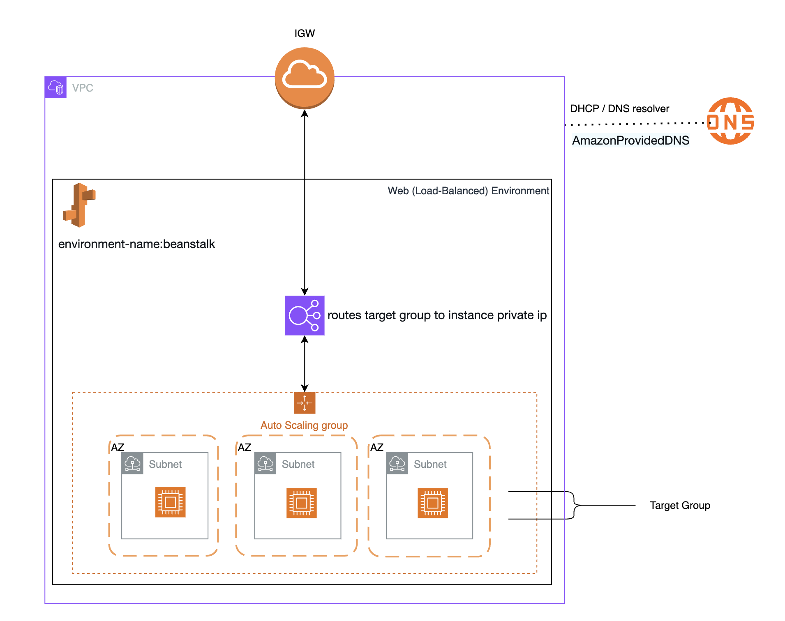

Elastic Container Service Demo

Fargate with awsvpc network mode

Doc: https://docs.google.com/document/d/1WwuFcPw48TLmQPSN-A06IWc-TtmRrlUazsQGOnJywpM/edit?tab=t.dr9o3a2l6qsu#heading=h.1c4rdf77ygvu

Create:
Cluster
- [x] Cluster
  - Execution Role (ECS to pull images etc)
  - Task Role (task to access AWS services)
  - CloudWatch Log Group
  - VPC/Subnet (existing/new)
  - Service Connect
  For EC2 Only:
  - Instance Role (for instance self registration to ECS)
  - Capacity Provider
  - ASG
- [x] Task Definition
- [x] Service to run Task Definition in Cluster
  - Use Service Connect to deploy various task definitions in the same cluster with discovery enabled.
